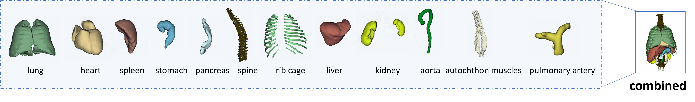
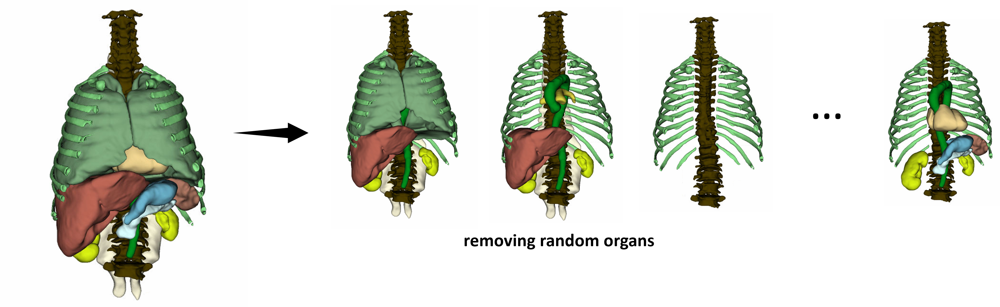
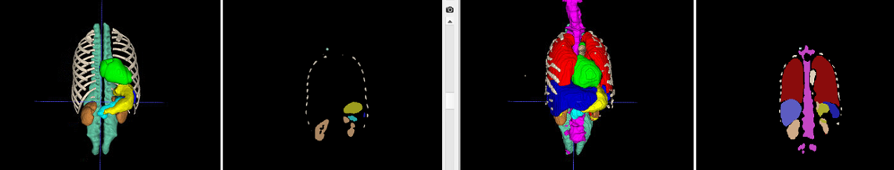

## Anatomy Completor


### Overview

**Title:**: A Multi-class Completion Framework for 3D Anatomy Reconstruction  <br> 
**Link to paper:** https://arxiv.org/abs/2309.04956 <br> 
**Link to benchmark dataset:** <br> 
**Data structure:** <ins>__voxel occupancy grid__</ins> | point cloud | mesh | others <br>


### Code


#### multi-class anatomy completion
12 anatomies (i.e., 12 classes): lung, heart, spleen, stomach, pancreas, spine, rib, cage, liver, kidney, aorta, autochthon muscles, pulmonary artery



create the benchmark dataset: create 10 incomplete sets by removing random anatomies from the 12 anatomies   <br>

input - incomplete anatomy set, ground truth - complete anatomy set containing 12 anatomies <br>

training samples: 18x10=180 <br> test samples: 27x10=270




results (left: input, right: reconstruction, both shown in 3D and coronal views)



#### reconstructing a single anatomy


#### reconstructing anatomies from skeleton


### Bibtex


```
@article{li2023anatomy,
      title={Anatomy Completor: A Multi-class Completion Framework for 3D Anatomy Reconstruction}, 
      author={Jianning Li and Antonio Pepe and Gijs Luijten and Christina Schwarz-Gsaxner and Jens Kleesiek and Jan Egger},
      journal={arXiv preprint arXiv:2309.04956},
      year={2023}
}
```

